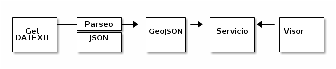
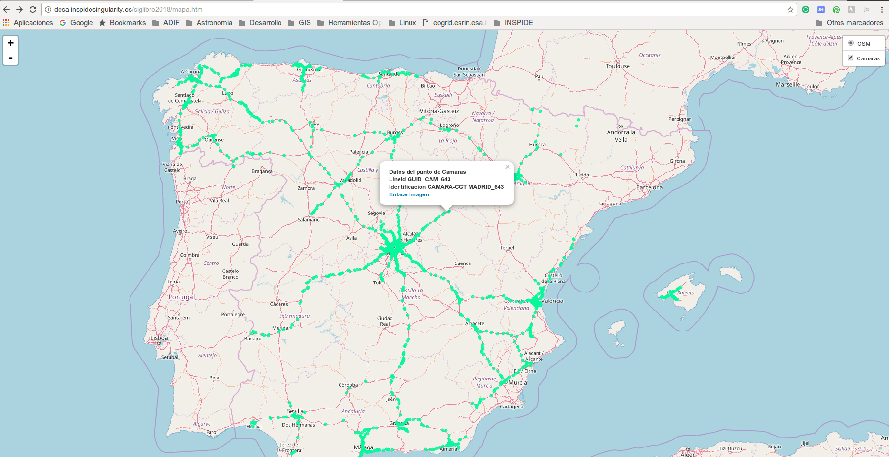

# Jornadas de SIG Libre 2018 - Uso de fuentes abiertas de datos de tráfico en DATEX II y seguridad vial

* Introducción
* [INSPIDE](http://www.inspide.com/)
* Modelos UML y XML
* Qué es DATEX
* Modelo de Datos
* Herramientas necesarias
* Parseo del XML o JSON
* Integración de la informacion en un mapa

## Introducción

* Etherpad compoartido https://oasis.sandstorm.io/grain/DSBS7bJytzoSAioj9EDK6p

* Condolencias a los que tengáis que utilizar este esquema
* DATEX se concibió como un estandar de intercambio de datos entre organismos de tráfico.
* Actualmente se encuentra la especificación DATEXII que es una extensión para permitir el intercambio con organizaciones privadas
* Es un estandard multiparte, mantenido por el  CEN Technical Committee 278, CEN/TC278, (Road Transport and Traffic Telematics) dividido en 3 partes:
    - Contexto y framework: metodología del modelado
    - Localización
    - Información de tráfico
* Usos principales
    - Administración de rutas y reorganización 
    - Administración de la infraestructura
    - Enlazado de la administración del tráfico con los sistemas de información
* Responde a un modelo UML establecido

## Qué es DATEX
* [Presentación Comisión Europea sobre DATEXII](http://akce.fd.cvut.cz/sites/default/files/datex2/presentations/D2_01b_02_Jorg_Freundenstein_Tour_through_DATEX_Model.pdf)
* Nos damos de alta en el portal http://www.datex2.eu/

## Práctica


* Obtener los datos de las cámaras de tráfico desde el portal estadístico de DGT - http://www.dgt.es
* Parsear los datos a un GeoJSON

```txt
$ xml2json camaras.xml camaras.json

```

* Mostrar la ubicación de las cámaras en Leaflet


## Referencias
* http://www.datex2.eu/
* Esquemas y utilidades - http://www.datex2.eu/current-version-reference
* Modelado - http://www.datex2.eu/sites/www.datex2.eu/files/d2-profile/pdf/DataModelTMPAndNavigationSystems_01-00-01_0.pdf
* Data Model Navigation online - http://www.datex2.eu/datex-model/HTML.Version_2.3/index.htm
* Ayuda para desarrolladores - http://www.datex2.eu/current-version-supporting
* Diccionario de datos - http://www.datex2.eu/content/datex-ii-v23-data-dictionary
* Guia para seguridad vial - http://www.datex2.eu/sites/www.datex2.eu/files/DATEX_II_Guide_for_safety_related_content_in_DATEX_v_2.3.pdf
* Modelo relacionado con seguridad vial - http://www.datex2.eu/sites/www.datex2.eu/files/DATEX_II_Guide_for_safety_related_content_in_DATEX_v_2.3.pdf
* DGT3.0 -  http://www.dgt.es/es/el-trafico/dgt-3-0/index.shtml

## Herramientas
* xml2json - https://www.npmjs.com/package/xml2json-cli
